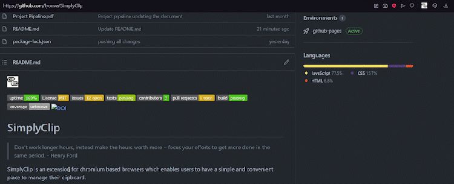

<p align="center">
    
</p>


# SimplyClip
[](https://opensource.org/licenses/MIT)

[](https://www.google.com/chrome/)

[](https://github.com/lyonva/SimplyClip/issues)
[](https://github.com/lyonva/SimplyClip/releases)


[](https://github.com/lyonva/SimplyClip/actions/workflows/create-docs.yml/badge.svg)
[](https://zenodo.org/badge/latestdoi/417197078)


> Don’t work longer hours, instead make the hours worth more – focus your efforts to get more done in the same period. - Henry Ford

SimplyClip is an extension for chromium based browsers which enables users to have a simple and convenient place to manage their clipboard.

Have multiple things to copy and keep track of? SimplyClip is here to help you out.

-   Copy any text, image or link from a web page.
-   Keyboard shortcuts to paste the top 10 items in your clipboard (To be implemented in future).
-   Search through the list of everything that you've copied.
-   Unlimited focus!

<placeholder UI-gif>


## Getting started

Add the SimplyClip Extension on to your Chrome browser.

SimplyClip would let you have all your snippets at one place.

### Get My Snippets

SimplyClip allows you to select text, links and images and adds them to the clipboard. Just select the snippet and perform Copy/Cut and Voila! your content would be copied to the clipboard.

### Where is that one thing?

Looking for a particular snippet you copied? We got you covered! Search within our search bar and find the one you are looking for.

### Destroy It All

Delete all the content added to the clipboard with a single button press. You could also delete individual text snippets added to the clipboard.

### Edit Text

Simply Clip allows you to customize the text copied to the clipboard. Just press the edit button right next to the copied text and change the content without an Hashle.

### Welcome to the Dark Side

Tired of the old and vanilla white background? Just toggle the switch and enjoy the power of the Dark side!

<placeholder theme-switch-gif>

### Save Me..

Just press the Save List button on SimplyClip and get your content saved as a CSV file on your local machine.
<placeholder theme-switch-gif>
    
### Clip an Image

Want to clip an Image to the clipboard? Well, now you can using SimplyClip. Right click on the image and select Copy to Clipboard. Your image would right away be copied to the clipboard.
<placeholder theme-switch-gif>

### Want a Break?

Turn off SimplyClip by clicking on the SimplyClip icon. 

## Setting up the Extension

1.  Get the repsitory using any of the below two methods :
    -   Download the repository using Code > Download Zip on our project github page.
    -   Clone the reporitory using **_[GIT](https://git-scm.com)_**
    ```
    git clone https://github.com/lyonva/SimplyClip
    ```
1.  Manually install SimplyClip using the following steps:
    -   Head to the extensions page by typing in `chrome://extensions` in your browser address bar.
    -   Enable the developer mode by toggling the button on the top right.
    
    -   Click on **_load Unpacked_** button.
    
    - Select the `src` folder from this repository.
    
    - Enable the chrome extension.
    

## Troubleshooting

If you're having trouble running the extension, try the following -

1. When loading the extension for the first time, reload the pages for it to recognize the extension.
2. Consider reloading the extension and all the browser pages.
3. If the issue still persists, please write to us at simplyclip@outlook.com and we will get back to you as soon as possible.

## Getting involved

Thank you for caring for this project and getting involved. To start, please check out [contributing](https://github.com/lyonva/SimplyClip/blob/main/CONTRIBUTING.md) and [code of conduct](https://github.com/lyonva/SimplyClip/blob/main/CODE_OF_CONDUCT.md). For more technical detail of implementation of code, you can check out the documentation. When you want to get your hands on the project, take a peek into the [github project](https://github.com/lyonva/SimplyClip/projects/1), assign yourself a task, move it to To-Do, and convert it into an issue and assign it to yourself.

Check out the [online documentation](https://lyonva.github.io/SimplyClip/) if you want to contribute or find out about the inner workings of ScheduleBot.

### Languages

-   JavaScript
-   HTML
-   CSS

### Software Requirements

-   Node.js
-   NPM

## Releases

- [v1.0](https://github.com/lalit10/SimplyClip/releases/tag/1.0.0)
- [v1.1](https://github.com/lyonva/SimplyClip/releases/tag/1.1.0)
- Latest:[v2.0](link to our release or chrome store)

## Future Features

### **Gimme What I Want**

Functionality that enables clipboard list to be downloaded in multiple file formats like PDF, Word, CSV etc.

### **Paste What I Want**

Keyboard shortcuts should allow you to paste which item from the clipboard you want from the top 10 elements. (Work already in progress on 'rramakr' branch).

### **Why Isn't It Where I Want**

Enanble the extension to work on multiple browsers such as Firefox, Safari, etc.
        
### **Gimme Everything**


Enable the extension to work in sync with the system clipboard so that the content can be switched across browsers.

## Improvements of this version compared to the previous one

###  Added features

-   Search bar for the list of copied items.
-   Button to clear all of the copied items list.
-   Dark mode.
-   Context menu options for copying links and images directly.
-   Save button to export the list into CSV file.
-   Button to disable the extension temporarily. 
-   Clipping an image (.png).

### Fixing issues that were in the previous version
-   Recognizing hyperlink copying.
-   Recognizing a copy on the user context menu.
-   Fixing multiple bugs.
-   There was basically no documentation in the code at all, now all of the code is documented.
-   We had to rework the plug-in. Previously everything was done using script injection. Now we use message passing to minimize invasion.


## Contributors

---

<table>
  <tr>
      <td align="center">
          <a href="https://github.com/lyonva">
              
              <br />
              <sub>
                  <b>Leo</b>
              </sub>
          </a>
          <br />
      </td>
      <td align="center">
        <a href="https://github.com/ConnorS1110">
            
            <br />
            <sub>
                <b>Connor</b>
            </sub>
        </a>
        <br />
      </td>
      <td align="center">
          <a href="https://github.com/ashwith161">
              
              <br />
              <sub>
                  <b>Ashwith</b>
              </sub>
          </a>
          <br />
      </td>
      <td align="center">
          <a href="https://github.com/Capt-Fluffy-Bug">
              
              <br />
              <sub>
                  <b>Rahul</b>
              </sub>
          </a>
          <br />
      </td>
      <td align="center">
          <a href="https://github.com/vasuagrawal19">
              
              <br />
              <sub>
                  <b>Vasu</b>
              </sub>
          </a>
          <br />
      </td>
      <td align="center">
          <a href="https://github.com/Muhammad-Alahmadi">
              
              <br />
              <sub>
                  <b>Muhammad</b>
              </sub>
          </a>
          <br />
      </td>
  </tr>
    
</table>

**_Enjoy using SimplyClip. Make sure to follow the page for any new updates!_**
